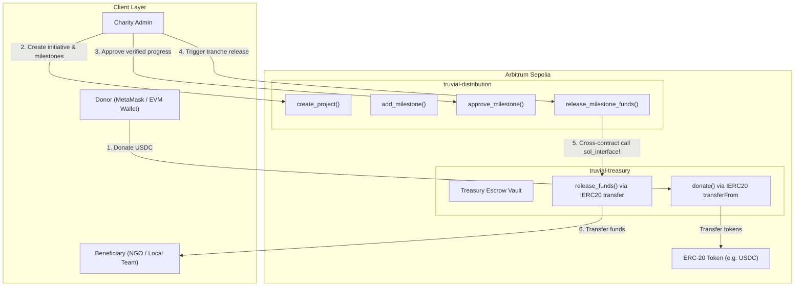

<h1 align="center">Truvial - Transparent Charity Escrow & Distribution (Arbitrum Stylus)</h1>

<p align="center">
  <strong>A Decentralized, Milestone-Based Charity Treasury & Payout Management Platform built on Arbitrum Stylus using Rust compiled to native WebAssembly (WASM).</strong>
</p>

<p align="center">
  
  
  
</p>

---

## 💡 Project Overview & Problem Statement

### The Problem
Traditional charitable giving suffers from an acute **"Black Box" problem**: once donors contribute funds, they lose all visibility and control over capital allocation. Upfront lump-sum grants to NGOs often lead to capital misdirection, lack of proof of work, and donor disillusionment.

### The Truvial Solution on Arbitrum Stylus
Truvial transforms charity funding into an **autonomous, milestone-verified escrow stream**:
1. **Decoupled Architecture:**
   * **`Treasury` Contract (Stylus/Rust):** Holds all donor funds in escrow. Accepts ERC-20 stablecoins (e.g. USDC) and enforces that capital can only be disbursed through strictly authenticated cross-contract calls from the Distribution contract.
   * **`Distribution` Contract (Stylus/Rust):** Enforces Role-Based Access Control (RBAC), manages charitable project lifecycles, and verifies milestone achievements before unlocking funding tranches.
2. **Why Arbitrum Stylus?**
   * **10x to 100x Lower Gas Fees:** Stylus executes Rust WASM directly on the Arbitrum Nitro node, making complex cryptographic calculations, storage lookups, and recurring milestone audits exponentially cheaper than standard EVM bytecodes.
   * **Memory Safety & High Performance:** Rust guarantees zero buffer overflows and concurrency safety, critical for handling charitable treasuries.
   * **Seamless EVM Interoperability:** Stylus contracts interact with existing EVM ERC-20 tokens (`IERC20`) and EVM wallets via standard ABIs.

---

## 🏗 Technical Architecture



---

## 📂 Repository Structure

```
├── contracts/
│   ├── treasury/                  # Arbitrum Stylus Escrow Vault (Rust)
│   │   ├── Cargo.toml             # Stylus SDK, Alloy Primitives dependencies
│   │   └── src/lib.rs             # sol_storage!, donate(), release_funds()
│   └── distribution/              # Arbitrum Stylus Milestone Engine (Rust)
│       ├── Cargo.toml             # Stylus SDK & sol_interface!
│       └── src/lib.rs             # RBAC, project management & cross-contract calls
├── frontend/                      # Next.js 16 + React 19 Web3 Application
│   ├── src/
│   │   ├── app/                   # App Router pages (Dashboard, Activity, Tx-Center, Analytics, Settings)
│   │   ├── components/            # Glassmorphic Navbar, theme toggle, wallet drawer
│   │   ├── services/
│   │   │   └── arbitrum.ts        # EVM wallet & Stylus interaction service
│   │   └── state/                 # Zustand state stores (wallet, projects, tx)
│   └── package.json               # Wagmi, Viem, React Query
├── scripts/
│   └── deploy_arbitrum.js         # Deployment script for Arbitrum Sepolia testnet
└── Cargo.toml                     # Root Rust workspace configuration
```

---

## ⚡ Smart Contract Specifications

### 1. Treasury Contract (`contracts/treasury/src/lib.rs`)
* **Storage (`sol_storage!`):**
  * `address admin`: Contract administrator.
  * `address distribution`: Authorized distribution engine address.
  * `address token`: Accepted ERC-20 donation currency (e.g. USDC).
  * `uint256 total_donated`: Total funds ever contributed to the escrow.
  * `mapping(address => uint256) donor_balances`: Verifiable ledger of donor contributions.
* **Core Public Methods:**
  * `donate(amount: U256)`: Pulls funds from `msg::sender()` into the contract via `IERC20.transfer_from`.
  * `release_funds(beneficiary: Address, amount: U256)`: Strictly callable only when `msg::sender() == self.distribution.get()`. Disburses funds via `IERC20.transfer`.

### 2. Distribution Contract (`contracts/distribution/src/lib.rs`)
* **Cross-Contract Integration (`sol_interface!`):**
  ```rust
  sol_interface! {
      interface ITreasury {
          function releaseFunds(address beneficiary, uint256 amount) external;
      }
  }
  ```
* **Storage (`sol_storage!`):**
  * `uint256 project_count`
  * `mapping(address => bool) beneficiary_whitelist`
  * `mapping(uint256 => Project) projects`
  * `mapping(uint256 => Milestone) milestones`
* **Core Public Methods:**
  * `create_project(title: String, beneficiary: Address, total_budget: U256)`
  * `add_milestone(project_id: U256, title: String, amount: U256)`
  * `approve_milestone(project_id: U256, milestone_id: U256)`
  * `release_milestone_funds(project_id: U256, milestone_id: U256)`

---

## 🛠 Local Setup & Development

### 1. Smart Contracts (Arbitrum Stylus)
Ensure Rust and the `wasm32-unknown-unknown` target are installed:
```bash
rustup target add wasm32-unknown-unknown
```

Compile and check the Stylus contracts:
```bash
# Check the entire Stylus workspace
cargo check --target wasm32-unknown-unknown

# Build release WASM binaries
cargo build --target wasm32-unknown-unknown --release
```

### 2. Frontend (Next.js & EVM)
```bash
cd frontend
npm install
npm run dev
```
Visit `http://localhost:3000` to interact with the Truvial platform on Arbitrum Sepolia.

---

## 🌐 Arbitrum Sepolia Network Parameters

| Parameter | Value |
| :--- | :--- |
| **Network Name** | Arbitrum Sepolia Testnet |
| **Chain ID** | `421614` (`0x66eee`) |
| **RPC Endpoint** | `https://sepolia-rollup.arbitrum.io/rpc` |
| **Block Explorer** | [https://sepolia.arbiscan.io/](https://sepolia.arbiscan.io/) |
| **Native Currency** | Arbitrum Sepolia ETH |
| **Stylus Treasury Address** | `0x38Fe48A7740eE7005118742A9e89d8708C36De76` |
| **Stylus Distribution Address** | `0x81De98877B5B6E47814b7eBE63B2d8d1C0e26B29` |
| **USDC Testnet Token** | `0x75faf114eafb1BDbe2F0316DF893fd58CE46AA4d` |

---

## 🏆 HackQuest Buildathon Submission Checklist
- [x] Rust smart contracts refactored to **Arbitrum Stylus SDK**.
- [x] EVM token standards applied (`IERC20` and `alloy_primitives`).
- [x] Inter-contract calls configured via `sol_interface!`.
- [x] Next.js frontend adapted for EVM wallets and Arbitrum Sepolia.
- [x] Glassmorphism & dark/light mode responsive dashboard.
- [x] Comprehensive deployment and test suite.
